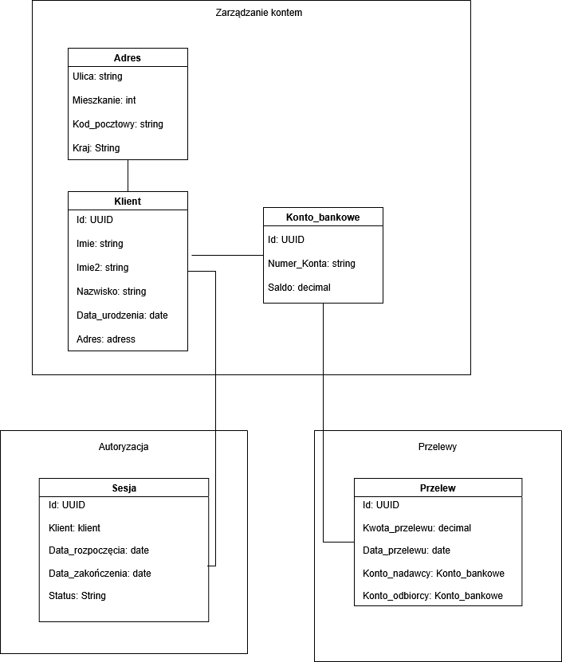

# TBO - Lab1
#### Mateusz Małkowski

## Opis zadania
Celem zadania było zamodelowanie bezpiecznej aplikacji bankowej (fragmentu) wykorzystując zasady Domain Driven Design. Należało:
1.	zidentyfikować i zdefiniować konteksty w obrębie systemu bankowego
2.	Zamodelować agregaty, encje i obiekty wartości
3.	Zdefiniować przyjęte założenia
4.	Zaprezentować wyniki

## Konteksty
Zdefiniowano konteksty:
•	Zarządzanie kontem - określa konto klienta oraz obsługę jego danych
•	Przelewy - określa realizacje przelewów
•	Uwirzytelnianie – odpowiada za sesję i uwierzytelnienie klienta
## Model

### Zarządzanie kontem
 - Agregat: Konto_bankowe
    - Atrybuty:
 *Id*, 
*Numer_Konta*, 
*Saldo*
 - Encja: Klient
    - Atrybuty: 
*Id*, 
*imie*, 
*imie2*, 
*nazwisko*, 
*Data_urodzenia*,
 *Adres*
 - Obiekt wartości: Adres
    - Atrybuty: *Ulica*, *Mieszkanie*, *Kod_pocztowy*, *Kraj *

### Przelewy
 - Agregat: Przelew
    - Atrybuty:
 *Id*, 
*Kwota_przelewu*, 
*Data_przelewu*,
 *Konto_nadawcy*, 
*Konto_odbiorcy *

### Kontekst: Autoryzacja
 - Agregat: Sesja
    - Atrybuty: 
*Id*,
*Klient”,
*Data_rozpoczęcia*,
*Data_zakończenia*,
*Status*

## Założenia i ograniczenia

Dla wszystkich klas atrybut *Id* musi być unikalny i nie może  być pusty.
- Konto_bankowe
 *Numer_konta * musi być w formacie IBAN oraz musi być unikalny
 - Klient
  *Imie* oraz *Nazwisko* muszą mieć ograniczoną ilość znaków oraz nie mogą być puste.
*Imie2* może być puste, ale jeżeli występuje, to również musi mieć ograniczoną ilość znaków.
 - Adres
Wszystkie wartości muszą mieć ograniczoną ilość możliwych znaków i nie mogą być puste, a wartość *Kod_pocztowy musi być w formacie XX-XXX
 - Przelew
*Konto_nadawcy* i *Konto_odbiorcy * muszą być różne, a *Kwota_przelewu* nie może być ujemna. Wszystkie wartości nie mogą być puste
- Sesja
*Data_rozpoczęcia* zawsze musi być wcześniej niż *Data_zakończenia*
